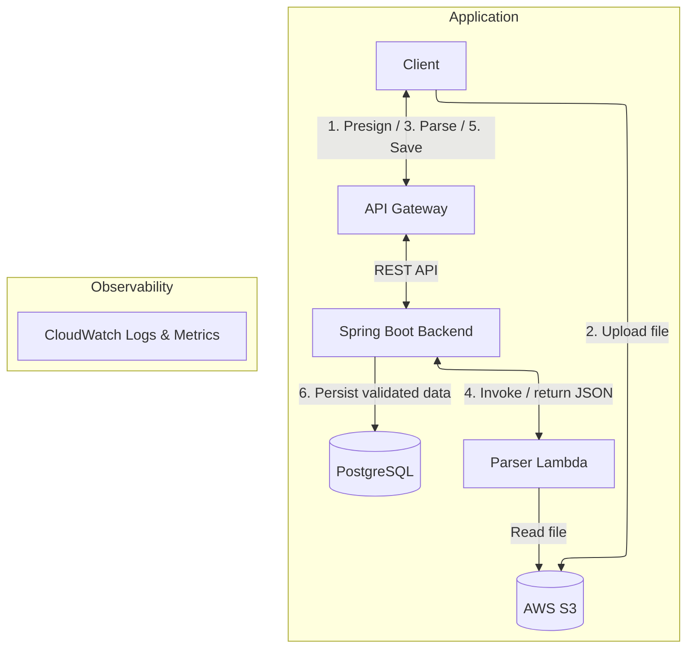

```mermaid
---
config:
  layout: elk
---
flowchart TD

subgraph APP["Application"]
    direction TD 
    C["Client"]
    API["API Gateway"]
    B["Spring Boot Backend"]
    S3[("AWS S3")]
    L["Parser Lambda"]
    DB[("PostgreSQL")]
    
    C <-->|"1. Presign / 3. Parse / 5. Save"| API
    API <-->|"REST API"| B
    C -->|"2. Upload file"| S3
    B <-->|"4. Invoke / return JSON"| L
    L -->|"Read file"| S3
    B -->|"6. Persist validated data"| DB
end

subgraph LOGS["Observability"]
    CLOUDWATCH["CloudWatch Logs & Metrics"]
end
    
```
